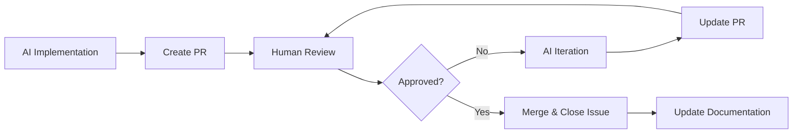

# GitHub Management Protocol for Academic Projects

## 🎯 Overview
This protocol extends the multi-agent system to provide comprehensive GitHub-based project management for academic research workflows. It enables the complete cycle: **Dialogue → Issue → Implementation → Review → Integration**.

## 📋 Core GitHub Workflow Components

### 1. Issue Management Protocol

#### 1.1 Automatic Issue Creation
When a user describes a research task, the AI must:

```markdown
**[🔧 Automation Agent - Issue Creation Mode]**
- **Task**: Convert user dialogue to GitHub Issue
- **Trigger**: User requests involving research tasks, analysis, or project changes
- **Process**:
  1. Extract core requirement from user dialogue
  2. Classify issue type (enhancement, bug, research-task, documentation)
  3. Generate structured issue using appropriate template
  4. Assign preliminary labels and milestone
  5. Create branch name suggestion following naming convention
```

#### 1.2 Issue Classification System
| Issue Type | Labels | Branch Prefix | Description |
|------------|---------|---------------|-------------|
| **Research Task** | `research`, `analysis` | `research/` | Literature review, data analysis, methodology |
| **Enhancement** | `enhancement`, `feature` | `feature/` | New functionality, tool improvements |
| **Bug Fix** | `bug`, `hotfix` | `hotfix/` | Error corrections, data cleaning |
| **Documentation** | `documentation`, `writing` | `docs/` | Papers, reports, README updates |
| **Data Management** | `data`, `pipeline` | `data/` | Data processing, ETL, validation |

#### 1.3 Issue Templates

**Research Task Template:**
```markdown
## 🔬 Research Task: [Title]

### 📋 Objective
[Clear statement of research goal]

### 📊 Data Requirements
- **Input Data**: [Specify files/databases needed]
- **Expected Output**: [Describe deliverables]
- **Dependencies**: [List prerequisite tasks]

### 🎯 Methodology
- **Approach**: [Quantitative/Qualitative/Mixed]
- **Tools**: [Statistical tests, software, libraries]
- **Standards**: [APA, reproducibility requirements]

### ✅ Acceptance Criteria
- [ ] Data analysis completed
- [ ] Results documented following academic standards
- [ ] Code reviewed and tested
- [ ] Findings integrated into project

### 🏷️ Labels
[Auto-assigned based on content]
```

### 2. Branch Management Strategy

#### 2.1 Academic GitFlow
```
main
├── develop
│   ├── feature/literature-review-echo-chambers
│   ├── feature/network-analysis-implementation
│   └── research/language-pattern-analysis
├── data/preprocessing-pipeline-v2
├── docs/methodology-update
└── hotfix/name-parsing-bug
```

#### 2.2 Branch Naming Conventions
- **Research**: `research/[topic-description]`
- **Features**: `feature/[functionality-name]`
- **Data**: `data/[processing-stage]`
- **Documentation**: `docs/[document-type]`
- **Hotfixes**: `hotfix/[issue-description]`

### 3. Pull Request Workflow

#### 3.1 PR Creation Protocol
```markdown
**[🔧 Automation Agent - PR Management Mode]**
- **Task**: Create and manage Pull Request
- **Inputs**: Completed work on feature branch, original issue reference
- **Process**:
  1. Generate PR title linking to original issue
  2. Auto-populate PR description with work summary
  3. Apply academic review checklist
  4. Assign reviewers based on content type
  5. Set merge conditions and quality gates
```

#### 3.2 Academic PR Template
```markdown
## 📝 Pull Request: [Title]

### 🔗 Related Issue
Closes #[issue-number]

### 📋 Changes Summary
- [List of changes made]
- [Files modified/added]
- [Methodology updates]

### 🧪 Testing & Validation
- [ ] Code tested with sample data
- [ ] Results reproducible
- [ ] Documentation updated
- [ ] Academic standards verified

### 📊 Academic Review Checklist
- [ ] **Methodology Sound**: Approach follows academic standards
- [ ] **Reproducible**: Code can be run by others
- [ ] **Documented**: Clear comments and documentation
- [ ] **Data Quality**: Input/output data validated
- [ ] **Citation Ready**: Proper attribution and references

### 🎯 Impact Assessment
**Research Impact**: [How this affects ongoing research]
**Data Pipeline**: [Changes to data processing]
**Documentation**: [Updates to papers/reports needed]
```

### 4. Review & Iteration Protocol

#### 4.1 Multi-Round Review Cycle


#### 4.2 Review Response Protocol
When human reviewer provides feedback, AI must:
1. **Acknowledge**: Confirm understanding of feedback
2. **Plan**: Outline specific changes to be made
3. **Implement**: Make requested changes
4. **Validate**: Test changes against acceptance criteria
5. **Update**: Push changes and update PR description

### 5. Project Management Integration

#### 5.1 Milestone Tracking
```markdown
**Research Phase Milestones:**
- 🔍 **Data Collection** (Issues: #1-5)
- 📊 **Analysis** (Issues: #6-12)
- 📝 **Documentation** (Issues: #13-18)
- 🚀 **Publication** (Issues: #19-25)
```

#### 5.2 Progress Visualization
Use GitHub Projects with columns:
- **Backlog**: Identified tasks not yet started
- **In Progress**: Active development
- **Review**: Awaiting human review
- **Testing**: Validation and quality checks
- **Done**: Completed and integrated

## 🛠️ Implementation Templates

### Template 1: Issue Creation from Dialogue
```markdown
**[🔧 Automation Agent - GitHub Integration]**
- **Task**: Create GitHub Issue from user request
- **Input**: User dialogue about research need
- **Output**: Structured GitHub Issue with proper classification

**Process**:
1. **Extract Core Requirement**: [Identify main research goal]
2. **Classify Task Type**: [Research/Enhancement/Bug/Documentation]
3. **Generate Issue Content**: [Use appropriate template]
4. **Assign Metadata**: [Labels, milestone, assignee]
5. **Create Branch Strategy**: [Suggest branch name and workflow]

**Deliverable**: GitHub Issue URL and branch creation command
```

### Template 2: PR Review Integration
```markdown
**[🔧 Automation Agent - Review Integration]**
- **Task**: Process human review feedback and iterate
- **Input**: PR review comments and suggestions
- **Output**: Updated implementation addressing all feedback

**Process**:
1. **Parse Feedback**: [Categorize comments by type and priority]
2. **Plan Changes**: [Create specific action items]
3. **Implement Updates**: [Make code/documentation changes]
4. **Self-Review**: [Validate changes against academic standards]
5. **Update PR**: [Push changes with clear commit messages]

**Deliverable**: Updated PR with addressed feedback and summary of changes
```

## 📊 Quality Gates & Standards

### Academic Quality Checklist
- [ ] **Reproducibility**: Can others replicate the results?
- [ ] **Documentation**: Is the methodology clearly explained?
- [ ] **Data Integrity**: Are data sources and transformations documented?
- [ ] **Statistical Rigor**: Are analyses statistically sound?
- [ ] **Citation Standards**: Are sources properly attributed?
- [ ] **Ethical Compliance**: Does work meet research ethics standards?

### Technical Quality Checklist
- [ ] **Code Quality**: Clean, readable, and well-commented code
- [ ] **Testing**: Adequate test coverage for data processing
- [ ] **Performance**: Efficient algorithms for large datasets
- [ ] **Security**: No sensitive data in version control
- [ ] **Dependencies**: All requirements documented and versioned

---

*This protocol ensures that every research task follows a structured, reviewable, and academically rigorous development process while maintaining the flexibility needed for iterative research workflows.*
