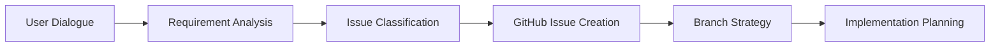
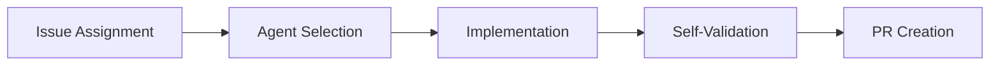
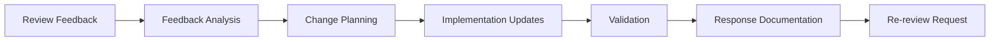

# Academic Research Iteration & Review Workflow

## 🎯 Overview
This document defines the structured iteration and review process for academic research projects, enabling seamless collaboration between AI agents and human researchers through GitHub-based workflows.

## 🔄 Core Iteration Cycle: Dialogue → Issue → Implementation → Review → Integration

### Phase 1: Dialogue & Requirement Capture
**Trigger**: User expresses research need or project requirement
**Agent**: 🔧 Automation Agent (GitHub Integration Mode)
**Output**: Structured GitHub Issue



**Process**:
1. **Dialogue Analysis**: Extract core research requirement from natural language
2. **Issue Creation**: Generate structured GitHub Issue using appropriate template
3. **Branch Planning**: Define development branch and workflow strategy
4. **Milestone Assignment**: Link to relevant research phase or project milestone

### Phase 2: AI Implementation
**Trigger**: GitHub Issue approved and assigned
**Agent**: Multiple agents based on task type (Research, Analysis, Documentation)
**Output**: Complete implementation on feature branch



**Process**:
1. **Agent Assignment**: Select appropriate agent(s) based on issue type and content
2. **Implementation**: Execute task following academic standards and protocols
3. **Self-Validation**: Run quality checks and validation tests
4. **PR Preparation**: Create Pull Request with comprehensive documentation

### Phase 3: Human Review & Feedback
**Trigger**: Pull Request submitted for review
**Actor**: Human researcher/supervisor
**Output**: Review comments and change requests

**Review Dimensions**:
- **Academic Rigor**: Methodology soundness, statistical validity, theoretical grounding
- **Technical Quality**: Code quality, reproducibility, documentation completeness
- **Research Impact**: Contribution to research goals, alignment with project objectives
- **Compliance**: Adherence to ethical standards, citation requirements, institutional guidelines

### Phase 4: AI Iteration & Response
**Trigger**: Human review feedback received
**Agent**: 🔧 Automation Agent (Review Integration Mode)
**Output**: Updated implementation addressing all feedback



**Process**:
1. **Feedback Parsing**: Categorize and prioritize review comments
2. **Change Implementation**: Make requested modifications with clear documentation
3. **Validation**: Test changes against original requirements and new feedback
4. **Response Communication**: Document changes and request re-review

### Phase 5: Integration & Documentation
**Trigger**: PR approved and ready for merge
**Agent**: 🔧 Automation Agent (Project Management Mode)
**Output**: Merged changes with updated project documentation

**Integration Checklist**:
- [ ] All review feedback addressed
- [ ] Tests pass and validation complete
- [ ] Documentation updated (README, methodology, citations)
- [ ] Project milestones updated
- [ ] Related issues linked and closed
- [ ] Next steps identified

## 🛠️ Agent Coordination Protocols

### Multi-Agent Task Assignment
When a GitHub Issue requires multiple agents, follow this coordination protocol:

```markdown
**[Intelligent Coordinator - Multi-Agent Assignment]**

**Issue Analysis**: #[issue-number] - [issue-title]
**Complexity**: [Simple/Moderate/Complex]
**Estimated Duration**: [Hours/Days/Weeks]

**Agent Assignment**:
- **Primary Agent**: [Agent Type] - [Core responsibility]
- **Secondary Agent(s)**: [Agent Type(s)] - [Supporting responsibilities]
- **Coordination Points**: [When agents need to hand off work]

**Execution Plan**:
1. [Primary agent task description]
2. [Handoff point and deliverables]
3. [Secondary agent task description]
4. [Integration and validation steps]
```

### Quality Gates by Agent Type

**Universal Quality Standards**: See [Agent Reference Guide](agent-reference.md) for complete quality gate specifications for all agent types.

**Key Quality Checkpoints**:
- Pre-implementation validation
- Mid-process quality checks  
- Final deliverable validation
- Handoff quality assurance

## 📊 Progress Tracking & Metrics

### Research Velocity Metrics
- **Issues Created per Week**: Rate of new research task identification
- **Issues Closed per Week**: Rate of completed research tasks
- **Average Issue Lifetime**: Time from creation to closure
- **Review Cycle Time**: Time from PR creation to approval
- **Iteration Rounds**: Average number of review cycles per issue

### Quality Metrics
- **First-Pass Approval Rate**: Percentage of PRs approved without iteration
- **Review Comment Density**: Average comments per PR (target: decreasing trend)
- **Academic Standard Compliance**: Percentage of work meeting quality gates
- **Reproducibility Rate**: Percentage of analyses successfully reproduced
- **Citation Accuracy**: Percentage of citations meeting APA standards

### Research Output Metrics
- **Papers in Progress**: Number of active manuscript development issues
- **Data Analysis Completion**: Percentage of planned analyses completed
- **Methodology Documentation**: Completeness of documented procedures
- **Collaboration Efficiency**: Time saved through automated processes

## 🚨 Escalation Protocols

### When to Escalate to Human Review
1. **Ambiguous Requirements**: Issue scope unclear after clarification attempts
2. **Ethical Considerations**: Research involves sensitive data or controversial topics
3. **Methodological Uncertainty**: Statistical approach or theoretical framework disputed
4. **Resource Constraints**: Task requires resources beyond current project scope
5. **Quality Concerns**: Multiple iteration rounds without convergence

### Escalation Process
```markdown
**[🚨 Escalation Required]**
- **Issue**: #[issue-number]
- **Reason**: [Brief description of escalation trigger]
- **Context**: [Relevant background and previous attempts]
- **Recommendation**: [Suggested next steps or alternatives]
- **Urgency**: [High/Medium/Low based on project timeline impact]
```

## 🎓 Academic Integration Best Practices

### Semester/Project Phase Alignment
- **Planning Phase**: Focus on literature review and methodology issues
- **Data Collection**: Emphasize data validation and preprocessing issues
- **Analysis Phase**: Prioritize statistical analysis and visualization issues
- **Writing Phase**: Concentrate on documentation and manuscript issues
- **Review Phase**: Handle peer review responses and revision issues

### Collaboration Patterns
- **Solo Research**: Single researcher with AI agent support
- **Supervised Research**: Student researcher with faculty oversight
- **Team Research**: Multiple researchers with coordinated agent assistance
- **Cross-Institutional**: Multi-site collaboration with standardized workflows

### Publication Pipeline Integration
- **Conference Submissions**: Fast-track analysis and writing for deadlines
- **Journal Manuscripts**: Comprehensive review cycles with high quality gates
- **Technical Reports**: Streamlined documentation with reproducibility focus
- **Grant Applications**: Research plan development with feasibility validation

---

*This iteration workflow ensures that every research task follows a structured, reviewable, and academically rigorous development process while maintaining the flexibility needed for iterative research discovery.*
