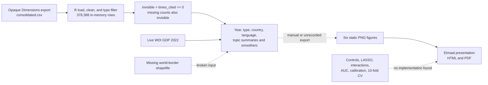

# Current Data-to-Claim Dependency Graph

This trace resolves [Trace the current data-to-claim dependency graph](https://github.com/YannJY02/InvisibleResearch/issues/47). It documents the latest researcher-supplied analysis without rerunning or changing the research. The Publication Compendium migration changed locators, not evidence: the Source Authority hash is unchanged and the large CSV now has a four-field external Artifact Version record.

## Decision

The current chain is only partially traceable. A local Dimensions-derived CSV can be followed through descriptive R transformations to six presentation figures by semantic correspondence, but there is no recorded command or manifest that binds the input, source revision, environment, figure bytes, and presentation claims into one reproducible run. Several presentation claims have no implementation in the analysis source.

## Exact inputs

| Input | Identity currently available | Used for | Missing link |
|---|---|---|---|
| `$DATA_ROOT/processed/dimensions_april2025_consolidated.csv` | 2,583,327,244 bytes; 565,391 data rows plus header; 78 columns; SHA-256 `9361454fd9e9c6479181dd60d98d44038aa4b346bb74654f7750345db6f27ab2`; record at `data/artifact-versions/dimensions-april2025-consolidated.json` | Sole tabular input to the latest analysis family | No export query, source snapshot date, Dimensions dataset/version, license record, or generating code. The unchanged source-authoritative R Markdown still requests `data/cs/dimensions_april2025/consolidated.csv`, not this external locator. |
| World Bank WDI indicator `NY.GDP.PCAP.CD`, year 2022 | Live `WDI(...)` call | GDP-per-capita country plot | No cached response, retrieval date, checksum, or API/version metadata. |
| `data/TM_WORLD_BORDERS_SIMPL-0.3.shp` | No matching local or tracked file | Choropleth branch | Missing. The console transcript records a file-not-found error. This branch has no presentation figure. |
| CSV columns used directly | `type`, `year`, `times_cited`, `research_org_countries`, `language`, `concepts`, `category_for`, identifiers and descriptive fields | Filtering, invisibility flag, country/language/topic summaries | Upstream derivation of `language`, field membership, citation snapshot, and organization-country metadata is absent. |
| R/CRAN environment | Console transcript identifies R 4.5.2 and some package downloads, including `pacman` 0.5.1, `here` 1.0.2, `WDI` 2.7.9, `estimatr` 1.0.6, `texreg` 1.39.5, `countrycode` 1.6.1, `cld3` 1.6.1, `ggrepel` 0.9.6, and `sf` 1.0-24 | Analysis execution | No `renv.lock`, complete `sessionInfo()`, system dependency record, or immutable package repository snapshot. `pacman::p_load(...)` installs missing packages during use. |

The tracked Python/OpenAlex/SCImago pipeline is not upstream of this analysis in the current evidence. No tracked file produces or reads this `consolidated.csv`; the R source reads the local CSV directly. The support note that describes a merged Dimensions/OpenAlex/SCImago pipeline is therefore narrative context, not an executable dependency link.

## Transformations actually present

The source-authoritative file is `papers/invisible-communication-science/analysis/analyze.Rmd`, SHA-256 `42395d4f28ddaf3d1f062d74d215e68fc93b691d47f2e6632943f976c65797b5`. It performs these transformations:

1. load the CSV, normalize column names, and coerce six numeric columns;
2. keep `article`, `book`, and `chapter` rows;
3. overwrite `invisible` as `1` when `times_cited == 0`, and also replace missing results with `1`;
4. remove empty and constant columns, producing an observed 378,388-row, 73-column in-memory `df`;
5. filter most displayed analyses to 2000–2022 and aggregate by year, publication type, country, language, topic, or category; and
6. draw descriptive counts/proportions with LOESS smoothers, plus a GDP scatterplot with an `lm` smoother.

The transformation is not a true "zero citations within three years" calculation. It uses cumulative `times_cited` from an undocumented extraction snapshot and excludes recent publication years; it does not calculate citations at each publication's three-year boundary.

The presentation's stated sample is also not bound to its stated period. The console's 378,388-row result is created before any 2000–2022 filter, and its first displayed records are from 1920. Figure-level code applies 2000–2022 filters, but the reported `N = 378,388` does not.

## Tables, figures, and claims

No durable result table is produced. `tabyl(type)` and `count(invisible)` are invoked interactively, while `extract_stats.R` prints summaries to the console from an absolute `/Users/yann.jy/Downloads/...` path. The console transcript does not retain the numeric outputs of those two table commands.

| Presentation artifact or claim | Closest source path | Link strength | Gap |
|---|---|---|---|
| `fig1_invisible_volume.png`: annual visible/invisible volume | Year aggregation and stacked area chart; the only `ggsave(...)` call targets `figures/fig1.png` | Inferred | No command writes the presentation filename and no run records its hash. |
| `fig2_by_type.png`: invisibility by publication type | Year/type mean and LOESS curves | Inferred | No explicit export. Default `geom_smooth()` bands may visualize 95% intervals, but no interval values or significance test are stored. |
| `fig3_gdp_invisibility.png`: country GDP relationship | All organization countries are unnested, joined to live WDI 2022 GDP, then shown with an `lm` smoother | Inferred | Presentation says "first author's country," but the code does not select a first author. No correlation coefficient or inferential result is stored. |
| `fig4_language.png`: English vs non-English invisibility | `language == "en"` split, annual means, LOESS | Inferred | The upstream language classifier/version is absent; no explicit export. |
| `fig5_language_gap.png`: English minus non-English gap | Annual means, pivot, subtraction, LOESS | Inferred | No explicit export; causal wording about why the gap changes is not tested. |
| `fig6_pub_volume.png`: language publication volume | Annual counts by English/non-English | Inferred | The analysis section titled "Figure 6" is empty; this image instead appears to come from the third plot under Figure 4. |
| `N = 378,388` for 2000–2022 | Console trace of the type-filtered `df` | Contradicted | The count includes pre-2000 rows; the period filter happens later. |
| `48%` invisible within three years | `invisible = times_cited == 0` and interactive counts | Partial | The numeric table output is absent, and the variable is cumulative zero citations rather than a three-year-window measure. |
| "significantly" different by geography, language, and type | Descriptive proportions and visual smoothers | Unsupported as inferential wording | No hypothesis test or stored estimate supports the word "significantly"; visual smoother bands alone do not establish it. |
| 95% CI | Default `geom_smooth()` behavior on several plots | Partial | Plot bands may be 95% intervals, but the level is not declared and no interval values or model assumptions are stored. |
| Controls, regularized/LASSO regression, interactions, odds ratios, AUC, calibration, and 10-fold CV | Presentation methods and appendix text only | Orphan claim | No corresponding implementation, fitted object, result table, or package call exists in the analysis source. `estimatr` and `texreg` are loaded but unused. |

The six ignored local PNGs are consumed by `papers/invisible-communication-science/manuscript/etmaal2026_presentation.Rmd`; its setup chunk renders slides but does not run the analysis. Their SHA-256 identities are:

| Figure | SHA-256 |
|---|---|
| `fig1_invisible_volume.png` | `752f31c3472fb8f3f466bffeea23adc0164816eeb819c363bdff3d3cb045202c` |
| `fig2_by_type.png` | `b6626b482a10d1620c260419009a41a3ec62328e2b60bcc077aacfc659ad52b0` |
| `fig3_gdp_invisibility.png` | `3a21987f94efed0b18ad52d30cc4027f4f2a11e4bf14e62670e34730e029368b` |
| `fig4_language.png` | `b8ae354ce6aae16385dc4adfe56a267f32a52fa7e036225d667cb4ced7318eb9` |
| `fig5_language_gap.png` | `12361ee5ab1123f9a78100fb7cd34237efd8a89ac58792976a34317fdc7ca7ca` |
| `fig6_pub_volume.png` | `c4091470ab560685006a628939e6f0e34d6e771cc941fea9548489e32f3b6a17` |

## Execution evidence and breaks

The transcript retained at `GoogleDrive:InvisibleResearch/archive/writing-report-legacy/Slides/material/output.md`, SHA-256 `b64190b0e599d3c962b020e641b9bdf102f541626dc797793d16acc536ce043a`, is not a clean end-to-end render. It:

- executes the archived `analyze_v2.Rmd` path variant rather than the source-authoritative CSV path;
- installs missing packages interactively and restarts R;
- records the 378,388-row `df` glimpse;
- prompts interactively when saving `figures/fig1.png`;
- fails on the absent shapefile and then shows later chunks entered manually; and
- contains no complete session manifest, input hash, source hash, output hash, or successful one-command exit.

The presentation source, SHA-256 `2934f5ac110d6825ab232ee34e1e93ed72b881d93187bd84bd41b69b1a3377a5`, was edited after the figures and embeds the six static filenames. No provenance record connects that revision to the figure hashes or to a successful analysis run.

## Required links before candidate eligibility

A later provenance contract must bind, at minimum:

1. the Dimensions export identity and extraction/query metadata;
2. the exact analysis source revision and declared relative input paths;
3. an immutable R environment and external WDI/shapefile snapshots;
4. one non-interactive command that regenerates named tables and figures;
5. a manifest linking every output hash to its input hashes and code revision; and
6. a claim matrix that either links presentation claims to produced evidence or marks them outside the executable compendium.

This trace does not decide whether the statistical claims are substantively correct. It establishes which claims are currently connected to executable evidence, which is the boundary needed for later Paper Analysis eligibility and provenance decisions.
